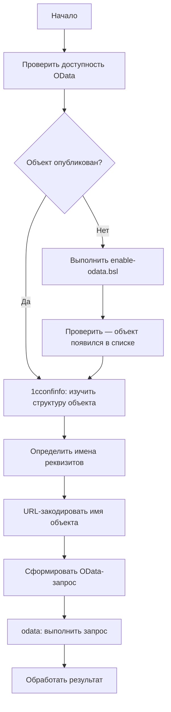

# Полное руководство: 1cconfinfo + OData

Руководство описывает, как использовать скиллы `1cconfinfo` и `odata` совместно
для анализа структуры конфигурации 1С и получения данных через OData.

## Схема процесса



## Шаг 0. Настройка credentials

Создайте `env.json` на основе `env.example.json`:

```json
{
  "default": {
    "odata_url": "http://localhost/your_base/odata/standard.odata",
    "odata_user": "Администратор",
    "odata_password": "пароль"
  }
}
```

Добавьте `env.json` в `.gitignore`.

Загрузите переменные для сессии:

```bash
ODATA_URL=$(python -c "import json; d=json.load(open('env.json', encoding='utf-8')); print(d['default']['odata_url'])")
ODATA_AUTH=$(python -c "import base64,json; d=json.load(open('env.json', encoding='utf-8')); u=d['default']['odata_user']; p=d['default']['odata_password']; print(base64.b64encode(f'{u}:{p}'.encode()).decode())")
```

## Шаг 1. Проверить доступность OData

```bash
curl -s \
  -H "Authorization: Basic $ODATA_AUTH" \
  -H "Accept: application/json" \
  "$ODATA_URL/"
```

Или используйте скрипт:

```bash
bash examples/check-availability.sh
```

Если нужный объект не в списке — перейдите к шагу 1а.

### Шаг 1а. Включить объект в OData (если не опубликован)

Выполните в 1С (режим Сервер / Внешнее соединение):

```bsl
МассивОбъектов = Новый Массив();
МассивОбъектов.Добавить(Метаданные.Справочники.ИмяСправочника);
УстановитьСоставСтандартногоИнтерфейсаOData(МассивОбъектов);
```

Подробнее — см. `examples/enable-odata.bsl`.

## Шаг 2. Изучить структуру объекта (1cconfinfo)

Найдите XML-файл объекта в выгрузке конфигурации:

```
cf/Catalogs/ИмяСправочника.xml
cf/Documents/ИмяДокумента.xml
```

В секции `<ChildObjects>` найдите реквизиты (`<Attribute>`) и табличные части (`<TabularSection>`).

Пример структуры:

```xml
<ChildObjects>
  <Attribute uuid="...">
    <Properties>
      <Name>ФизическоеЛицо</Name>
      <Type>
        <v8:Type>cfg:CatalogRef.ФизическиеЛица</v8:Type>
      </Type>
    </Properties>
  </Attribute>
</ChildObjects>
```

## Шаг 3. URL-кодирование имени объекта

```bash
python -c "from urllib.parse import quote; print(quote('ИмяОбъекта'))"
```

Примеры:

| Имя 1С | URL-encoded |
|--------|-------------|
| `Сотрудники` | `%D0%A1%D0%BE%D1%82%D1%80%D1%83%D0%B4%D0%BD%D0%B8%D0%BA%D0%B8` |
| `ФизическиеЛица` | `%D0%A4%D0%B8%D0%B7%D0%B8%D1%87%D0%B5%D1%81%D0%BA%D0%B8%D0%B5%D0%9B%D0%B8%D1%86%D0%B0` |
| `Организации` | `%D0%9E%D1%80%D0%B3%D0%B0%D0%BD%D0%B8%D0%B7%D0%B0%D1%86%D0%B8%D0%B8` |
| `ЗаявкаНаОтпуск` | `%D0%97%D0%B0%D1%8F%D0%B2%D0%BA%D0%B0%D0%9D%D0%B0%D0%9E%D1%82%D0%BF%D1%83%D1%81%D0%BA` |

## Шаг 4. Выполнить OData-запрос

### Получить первые N записей справочника

```bash
curl -s \
  -H "Authorization: Basic $ODATA_AUTH" \
  -H "Accept: application/json" \
  "$ODATA_URL/Catalog_%D0%A1%D0%BE%D1%82%D1%80%D1%83%D0%B4%D0%BD%D0%B8%D0%BA%D0%B8?\$top=10&\$format=json"
```

### Выбрать конкретные поля

```bash
curl -s \
  -H "Authorization: Basic $ODATA_AUTH" \
  -H "Accept: application/json" \
  "$ODATA_URL/Catalog_%D0%A1%D0%BE%D1%82%D1%80%D1%83%D0%B4%D0%BD%D0%B8%D0%BA%D0%B8?\$select=Ref_Key,Description,Code&\$format=json"
```

### Фильтрация

```bash
# Только не помеченные на удаление
curl -s \
  -H "Authorization: Basic $ODATA_AUTH" \
  -H "Accept: application/json" \
  "$ODATA_URL/Catalog_%D0%A1%D0%BE%D1%82%D1%80%D1%83%D0%B4%D0%BD%D0%B8%D0%BA%D0%B8?\$filter=DeletionMark eq false&\$top=10&\$format=json"

# Поиск по наименованию
curl -s \
  -H "Authorization: Basic $ODATA_AUTH" \
  -H "Accept: application/json" \
  "$ODATA_URL/Catalog_%D0%A1%D0%BE%D1%82%D1%80%D1%83%D0%B4%D0%BD%D0%B8%D0%BA%D0%B8?\$filter=contains(Description,'Иванов')&\$format=json"
```

### Использовать скрипт

```bash
bash examples/query-catalog.sh Сотрудники 5 "Ref_Key,Description"
```

## Шаг 5. Формат ответа

```json
{
  "odata.metadata": "http://host/base/odata/standard.odata/$metadata#Catalog_Сотрудники",
  "value": [
    {
      "Ref_Key": "xxxxxxxx-xxxx-xxxx-xxxx-xxxxxxxxxxxx",
      "DataVersion": "AAAAAAAAAAE=",
      "DeletionMark": false,
      "Code": "000000001",
      "Description": "Иванов Иван Иванович",
      "ФизическоеЛицо_Key": "yyyyyyyy-yyyy-yyyy-yyyy-yyyyyyyyyyyy",
      "Predefined": false,
      "PredefinedDataName": ""
    }
  ]
}
```

### Стандартные поля OData в 1С

| Поле OData | Соответствие 1С | Описание |
|------------|-----------------|----------|
| `Ref_Key` | Ссылка | UUID элемента |
| `Description` | Наименование | Строковое представление |
| `Code` | Код | Код элемента |
| `DeletionMark` | ПометкаУдаления | Флаг удаления |
| `Predefined` | Предопределённый | Является ли предопределённым |
| `*_Key` суффикс | Ссылочный реквизит | UUID связанного объекта |
| `*@navigationLinkUrl` | — | Ссылка для получения связанного объекта |

## Справочник параметров OData

| Параметр | Описание | Пример |
|----------|----------|--------|
| `$top` | Лимит записей | `\$top=10` |
| `$skip` | Пропустить N | `\$skip=20` |
| `$filter` | Фильтр | `\$filter=DeletionMark eq false` |
| `$select` | Поля | `\$select=Ref_Key,Description` |
| `$orderby` | Сортировка | `\$orderby=Description asc` |
| `$format` | Формат | `\$format=json` |

## Операторы фильтрации

| Оператор | Описание | Пример |
|----------|----------|--------|
| `eq` | Равно | `Code eq '000001'` |
| `ne` | Не равно | `DeletionMark ne true` |
| `gt` / `lt` | Больше / меньше | `Date gt datetime'2024-01-01T00:00:00'` |
| `contains` | Содержит | `contains(Description,'Иванов')` |
| `startswith` | Начинается с | `startswith(Code,'000')` |

## Типичные ошибки

### 401 Unauthorized / 401.5

Неверная кодировка credentials. Убедитесь, что используете заголовок `Authorization: Basic`,
а не флаг `-u` в curl.

### `"Параметр не поддерживается"`

Знак `$` интерпретируется bash как переменная. Экранируйте его: `\$top`, `\$filter`.

### Объект не найден в списке сущностей

Объект не опубликован через OData. Выполните `enable-odata.bsl`.
