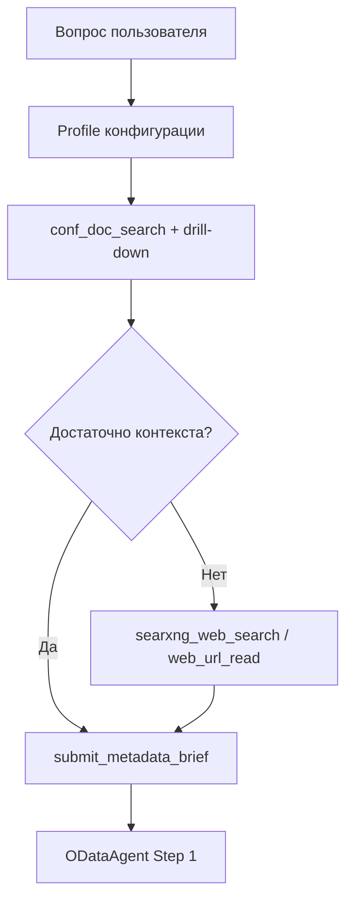
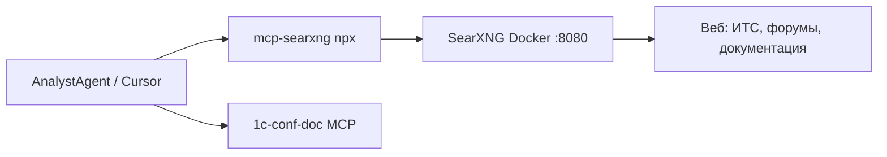

# SearXNG: веб-поиск для аналитика метаданных

> Локальный self-hosted поиск через MCP `mcp-searxng` — fallback, когда conf-doc и profile конфигурации не дают достаточно контекста для OData-запроса.

---

## Зачем SearXNG

Аналитик метаданных (`AnalystAgent`, `/analyze`) в первую очередь работает с **conf-doc** (семантический поиск по метаданным вашей конфигурации) и **domain profile** (`skills/analyst/profiles/`).

SearXNG подключается **только когда этого недостаточно**:

- неясны имена реквизитов или связей между объектами;
- нужно поведение OData в конкретной конфигурации (виртуальные таблицы, особенности публикации);
- требуется внешняя документация 1С (ИТС, форумы, статьи).

Инструменты MCP: `searxng_web_search`, `web_url_read`.

---

## Gating: conf-doc перед SearXNG

Бот **принудительно** блокирует вызов SearXNG до успешного conf-doc:

```text
Сначала выполни conf_doc_search (keyword) и при необходимости
conf_doc_get_object / conf_doc_get_object_chunk.
SearXNG и submit_metadata_brief доступны только после conf-doc.
```

Реализация: [`bot/agents/analyst/analyzer.py`](../bot/agents/analyst/analyzer.py) — whitelist `_WEB_SEARCH_TOOLS` и проверка preflight conf-doc.

Workflow аналитика (промпт): [`bot/agents/analyst/prompts.py`](../bot/agents/analyst/prompts.py).



---

## Архитектура



| Компонент | Роль |
|-----------|------|
| **SearXNG** (Docker) | Self-hosted metasearch, JSON API |
| **mcp-searxng** (`npx -y mcp-searxng`) | MCP-мост stdio → SearXNG |
| **AnalystAgent** | Вызывает tools после conf-doc gating |
| **Cursor IDE** | Тот же MCP через `.cursor/mcp.json` |

---

## Docker-стенд

### Запуск

```bash
docker compose -f docker-compose.searxng.yml up -d
docker compose -f docker-compose.searxng.yml logs -f searxng
```

Конфиг: [`docker/searxng/settings.yml`](../docker/searxng/settings.yml). Обязательно включён JSON-формат:

```yaml
search:
  formats:
    - html
    - json
```

### Health-check

```bash
curl "http://localhost:8080/search?q=test&format=json"
```

Ожидайте JSON с полем `results`. Если MCP возвращает **403** — проверьте `formats: [html, json]` в settings.yml.

---

## MCP в боте (env.json)

Секция `agents.analyst.mcp_servers.searxng` в [`env.example.json`](../env.example.json). По умолчанию `enabled: false`.

### Быстрое включение

```bash
docker compose -f docker-compose.searxng.yml up -d
python scripts/enable_searxng_mcp.py   # патч env.json (один раз)
python scripts/test_searxng_mcp.py     # smoke-test MCP
```

Скрипт `enable_searxng_mcp.py` выставляет `enabled: true` и добавляет `searxng_web_search`, `web_url_read` в `allowed_mcp_tools`.

### Ручная настройка

```json
{
  "agents": {
    "analyst": {
      "mcp_servers": {
        "searxng": {
          "enabled": true,
          "transport": "stdio",
          "command": "npx",
          "args": ["-y", "mcp-searxng"],
          "env": {
            "SEARXNG_URL": "http://localhost:8080"
          }
        }
      },
      "allowed_mcp_tools": [
        "conf_doc_search",
        "conf_doc_get_object",
        "conf_doc_get_object_chunk",
        "conf_doc_list_objects",
        "conf_doc_list_configurations",
        "conf_doc_health",
        "searxng_web_search",
        "web_url_read"
      ]
    }
  }
}
```

Полная схема профиля — в [`configuration.md`](configuration.md).

**Требования:** Node.js (для `npx`), запущенный SearXNG на `SEARXNG_URL`.

---

## MCP в Cursor IDE

Шаблон: [`mcp.analyst.example.json`](../mcp.analyst.example.json).

```json
{
  "mcpServers": {
    "1c-conf-doc": {
      "command": "C:\\ПервыйБИТ\\ИИ\\1c-conf-doc\\.venv\\Scripts\\python.exe",
      "args": ["-m", "onec_conf_doc.mcp"],
      "env": {
        "CONF_DOC_API_URL": "http://localhost:8050",
        "CONF_DOC_CONFIGURATION": "ЗарплатаИУправлениеПерсоналомКОРП"
      }
    },
    "searxng": {
      "command": "npx",
      "args": ["-y", "mcp-searxng"],
      "env": {
        "SEARXNG_URL": "http://localhost:8080"
      }
    }
  }
}
```

Скопируйте в `.cursor/mcp.json`. **1c-conf-doc обязателен**; SearXNG — опционально для внешней документации.

---

## Инструменты MCP

| Tool | Назначение | Ключевые параметры |
|------|------------|-------------------|
| `searxng_web_search` | Поиск по вебу | `query`, опционально `pageno`, `time_range`, `language` |
| `web_url_read` | Чтение страницы в markdown | `url`, опционально `maxLength`, `section` |

Пример запроса аналитика: «1С OData InformationRegister виртуальная таблица Balance» — после того как conf-doc не дал однозначного ответа.

---

## Отладка

| Симптом | Действие |
|---------|----------|
| `searxng_web_search not available` | `enabled: true` в env.json; `python scripts/test_searxng_mcp.py` |
| HTTP 403 от SearXNG | `formats: [html, json]` в `docker/searxng/settings.yml`, перезапуск контейнера |
| SearXNG вызывается до conf-doc | Ожидаемое поведение gating — сначала keyword в conf-doc |
| Нет результатов | Проверьте `curl "http://localhost:8080/search?q=test&format=json"` |

Логи бота:

```text
AnalystAgent MCP [searxng]: tools=[searxng_web_search, web_url_read]
Analyst MCP: brief ready
```

---

## Eval и тестирование

| Скрипт | Назначение |
|--------|------------|
| [`scripts/test_searxng_mcp.py`](../scripts/test_searxng_mcp.py) | Smoke: подключение MCP + один web search |
| [`scripts/eval_analyst_block2.py`](../scripts/eval_analyst_block2.py) | Eval блока 2 (OData-вопросы ЗУП); SearXNG участвует при нехватке conf-doc контекста |

Чеклист ручной оценки: [`conf-doc-evaluation-checklist.md`](conf-doc-evaluation-checklist.md).

---

## Связанные файлы

| Файл | Описание |
|------|----------|
| [`docker-compose.searxng.yml`](../docker-compose.searxng.yml) | Docker Compose для SearXNG |
| [`docker/searxng/settings.yml`](../docker/searxng/settings.yml) | Настройки SearXNG |
| [`scripts/enable_searxng_mcp.py`](../scripts/enable_searxng_mcp.py) | Включение в env.json |
| [`scripts/test_searxng_mcp.py`](../scripts/test_searxng_mcp.py) | Smoke-test |
| [`skills/analyst-mcp/SKILL.md`](../skills/analyst-mcp/SKILL.md) | Операционный skill для AI-агента |
| [`configuration.md`](configuration.md) | Полная схема env.json |
